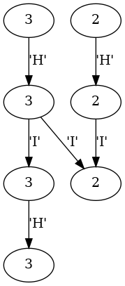
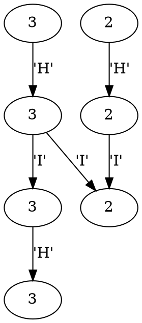

# Qudc

This is a simple parser that converts a qudit-based quantum circuit into an equivalent directed acyclic graph.

For example, consider a simple program consisting of Hadamard gates and CNOT gates applied to a qutrit (3-dimensional) and a qubit (2-dimensional).

```
qudit 0 3
qudit 1 2

h 0
h 1

c 0 1

h 0

m 0
m 1
```

The resulting graph:



Or as a `dot` file:



## Usage

`cargo run filename`